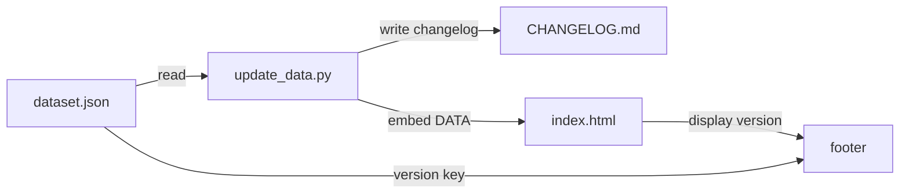

# Update Workflow — Italian Demographic Observatory

> Flusso di lavoro completo per l'aggiornamento automatizzato dei dati demografici da comunicati ISTAT, con validazione strutturale, sanity check (inclusa spike detection), versionamento semantico, changelog automatico e sincronizzazione HTML.

**Script:** `scripts/update_data.py`  
**Versione dataset corrente:** 1.5  
**Ultimo aggiornamento:** 2026-07-30

---

## Indice

1. [Prerequisiti](#1-prerequisiti)
2. [Struttura dei file](#2-struttura-dei-file)
3. [Payload ISTAT (input)](#3-payload-istat-input)
4. [CLI: comandi disponibili](#4-cli-comandi-disponibili)
5. [Pipeline di aggiornamento](#5-pipeline-di-aggiornamento)
6. [Regole di validazione](#6-regole-di-validazione)
   - [6.1 Validazione strutturale](#61-validazione-strutturale-validate_dataset)
   - [6.2 Sanity check](#62-sanity-check-sanity_checks)
   - [6.3 Spike Detection (>15% YoY)](#63-spike-detection-15-yoy)
7. [Versionamento & Changelog](#7-versionamento--changelog)
8. [Esempi d'uso](#8-esempi-duso)
9. [Manutenzione & risoluzione problemi](#9-manutenzione--risoluzione-problemi)
10. [Appendice: formato payload supportato](#appendice-formato-payload-supportato)

---

## 1. Prerequisiti

- **Python 3.9+** (sola libreria standard — nessuna dipendenza esterna)
- Repository clonato con struttura standard:

```
demographic-dash/
├── data/
│   ├── dataset.json            # Dataset JSON (unica fonte di verità)
│   └── istat_payload.json      # Payload ISTAT (opzionale, input nuovo dato)
├── docs/
│   ├── CHANGELOG.md            # Changelog in formato Markdown (generato)
│   ├── UPDATE_WORKFLOW.md      # Questo file
│   └── ...
├── scripts/
│   └── update_data.py          # Script di aggiornamento
├── index.html                  # Dashboard HTML (sincronizzato via --embed)
└── README.md
```

---

## 2. Struttura dei file

### `data/dataset.json`

Dataset strutturato contenente l'intero patrimonio informativo del progetto:

| Chiave | Tipo | Descrizione |
|---|---|---|
| `version` | string | Versione corrente del dataset (es. `"1.5"`) |
| `lastUpdate` | string | Data ultimo aggiornamento (ISO 8601: `YYYY-MM-DD`) |
| `license` | string | Licenza dei dati |
| `sources` | object | Oggetto con le fonti dati, ciascuna con `name`, `url`, `period`, `status`, `notes` |
| `observations` | object | Serie storiche, dati strutturati e proiezioni |
| `historicalTable` | array | Tabella eventi storici (7 periodi chiave) |
| `changelog` | array | Registro delle modifiche per versione |

### `scripts/update_data.py`

Script principale Python 3.9+ con le seguenti funzioni pubbliche:

| Funzione | Descrizione |
|---|---|
| `load_istat_payload()` | Carica payload ISTAT da file JSON (`data/istat_payload.json`) |
| `generate_simulated_payload()` | Genera payload simulato per test/dimostrazione |
| `sanity_checks()` | Controlli automatici su valori fuori scala, spike YoY, chiavi mancanti, gap temporali |
| `validate_dataset()` | Validazione strutturale completa del dataset (bloccante) |
| `apply_updates()` | Applica nuove osservazioni, incrementa versione, aggiorna metadati e changelog |
| `generate_changelog_md()` | Genera il contenuto Markdown di `docs/CHANGELOG.md` |
| `write_changelog_md()` | Scrive `docs/CHANGELOG.md` su disco |
| `format_dataset_for_js()` | Converte il dataset in una stringa JavaScript `const DATA = {...};` |
| `embed_dataset_in_html()` | Sostituisce il blocco `const DATA = {...}` in `index.html` con i dati aggiornati |
| `generate_report()` | Stampa report formale dettagliato nel terminale |
| `run_update()` | Esegue l'intero flusso di aggiornamento (carica payload → sanity check → applica → salva → changelog) |

---

## 3. Payload ISTAT (input)

I nuovi dati arrivano tramite un file JSON in `data/istat_payload.json` con questa struttura:

```json
{
  "source_note": "ISTAT - Bilancio demografico 2026",
  "update_type": "annuale",
  "observations": {
    "births": {
      "year": 2026,
      "value": 348000
    },
    "fertility": {
      "year": 2026,
      "value": 1.14
    },
    "population": {
      "year": 2026,
      "value": 58.8
    }
  },
  "notes": "Dato provvisorio, comunicato stampa ISTAT del ..."
}
```

**Campi accettati in `observations`:**
- `births` — nati vivi (valore assoluto, il dataset li esprime in migliaia se > 1000)
- `fertility` — TFR (figli per donna)
- `population` — popolazione residente (milioni)
- `elderly_ratio` — percentuale popolazione over 65
- `first_child_age` — età media al primo figlio (valore singolo, non serie)
- Qualsiasi altra chiave presente nel dataset esistente

Se il file `istat_payload.json` **non esiste**, lo script genera automaticamente un payload simulato basato sui trend storici (utile per test e dimostrazioni).

---

## 4. CLI: comandi disponibili

### 4.1 Tabella comandi

| Comando | Azione | Modifica file |
|---|---|---|
| `python scripts/update_data.py` | Mostra help con tutte le flag disponibili | Nessuno |
| `--check` | **Validazione dry-run** — carica payload, esegue sanity checks, stampa report. Nessuna modifica. | ❌ Nessuno |
| `--update` | **Aggiornamento dataset** — carica payload, sanity checks, applica modifiche a `dataset.json`, genera `CHANGELOG.md` | ✅ `dataset.json`, `CHANGELOG.md` |
| `--embed` | **Aggiornamento dataset + sincronizzazione HTML** (implica `--update`) | ✅ `dataset.json`, `CHANGELOG.md`, `index.html` |
| `--simulate` | Forza uso di payload simulato (combinabile con `--check`, `--update`) | Dipende dalle flag combinate |

### 4.2 Combinazioni più comuni

```bash
# 1. Test rapido (solo validazione con dati simulati)
python scripts/update_data.py --check --simulate

# 2. Verifica con payload reale (se istat_payload.json esiste)
python scripts/update_data.py --check

# 3. Aggiornamento completo del dataset + sincronizzazione HTML
python scripts/update_data.py --update --embed

# 4. Aggiornamento simulato (per test della pipeline)
python scripts/update_data.py --update --embed --simulate

# 5. Solo aggiornamento dataset senza sincronizzare HTML
python scripts/update_data.py --update
```

---

## 5. Pipeline di aggiornamento

Il flusso completo (`--update --embed`) esegue questi passi in sequenza:

```
┌─────────────────────────────────────┐
│  1. Carica dataset.json              │
│     validate_dataset()              │ ← Se fallisce → EXIT con errore
└────────────────┬────────────────────┘
                 ▼
┌─────────────────────────────────────┐
│  2. Carica payload                   │
│     load_istat_payload()            │
│     o generate_simulated_payload()  │
└────────────────┬────────────────────┘
                 ▼
┌─────────────────────────────────────┐
│  3. Sanity checks                    │
│     sanity_checks()                 │ ← Warning non bloccanti
│     • Range valori                   │    (l'aggiornamento procede)
│     • Spike detection (>15% YoY)    │
│     • Gap temporali                 │
│     • Anno duplicato                │
│     • Chiavi mancanti nel dataset   │
└────────────────┬────────────────────┘
                 ▼
┌─────────────────────────────────────┐
│  4. Applica aggiornamenti            │
│     apply_updates()                 │
│     • Aggiunge nuovi anni/valori    │
│     • Incrementa versione (minor)   │
│     • Aggiorna lastUpdate           │
│     • Genera changelog entry        │
└────────────────┬────────────────────┘
                 ▼
┌─────────────────────────────────────┐
│  5. Salva dataset.json               │
│     json.dump() ordinato            │
└────────────────┬────────────────────┘
                 ▼
┌─────────────────────────────────────┐
│  6. Genera CHANGELOG.md              │
│     write_changelog_md()            │
└────────────────┬────────────────────┘
                 ▼
┌─────────────────────────────────────┐
│  7. Sincronizza index.html           │  ← Solo se --embed
│     embed_dataset_in_html()         │
│     Sostituisce const DATA = {…}    │
└────────────────┬────────────────────┘
                 ▼
┌─────────────────────────────────────┐
│  8. Report finale                    │
│     generate_report()               │
│     • Dataset info                  │
│     • Nuovi dati elaborati          │
│     • Anomalie rilevate             │
│     • Riepilogo aggiornamento       │
└─────────────────────────────────────┘
```

---

## 6. Regole di validazione

### 6.1 Validazione strutturale (`validate_dataset()`)

Controlli **bloccanti** — se uno di questi fallisce, lo script termina con errore e non applica modifiche:

| Controllo | Descrizione | Codice |
|---|---|---|
| **Chiavi primo livello** | `version`, `license`, `sources`, `observations` obbligatorie | `if key not in data` |
| **Observations obbligatorie** | `births`, `fertility`, `population`, `elderly_ratio`, `first_child_age` devono esistere | `REQUIRED_OBSERVATIONS` |
| **Proiezioni** | `observations.projections.scenarios` deve essere un dict non vuoto | `if not isinstance(scenarios, dict)` |
| **Coerenza serie temporali** | Ogni serie deve avere `years` e `values` della stessa lunghezza | `len(years) != len(values)` → errore |
| **Coerenza elderly_ratio** | years/values devono avere stessa lunghezza | `len(er_years) != len(er_values)` |
| **first_child_age** | `value` e `year` obbligatori | `if "value" not in fca` |

### 6.2 Sanity check (`sanity_checks()`)

Controlli **non bloccanti** — l'aggiornamento procede comunque, ma le anomalie vengono registrate e segnalate nel report:

| Controllo | Soglia | Esempio di attivazione |
|---|---|---|
| **Range valori** | births: [0, 2M], fertility: [0, 5], population: [0, 100], elderly: [0, 100], first_child_age: [15, 50] | births = 3.000.000 → ⚠️ warning |
| **Spike YoY** | Variazione % > ±15% | births: 370K → 500K (+35%) → ⚠️ SPIKE |
| **Anno duplicato** | Se l'anno è già presente nel dataset | births 2025 già presente → ⚠️ warning |
| **Gap temporale** | Se il nuovo anno salta uno o più anni | ultimo 2024, nuovo 2026 → ⚠️ gap |
| **Chiavi mancanti** | Observations obbligatorie assenti | `elderly_ratio` missing → ⚠️ warning |

### 6.3 Spike Detection (>15% YoY)

La **Spike Detection** è una delle funzionalità più importanti dello script. Funziona così:

```python
SPIKE_THRESHOLD_YOY = 15.0  # soglia: ±15%

# Per ogni metrica, calcola la variazione percentuale anno su anno
pct_change = ((new_value - last_val) / abs(last_val)) * 100

# Se supera la soglia, registra un'anomalia
if abs(pct_change) > SPIKE_THRESHOLD_YOY:
    anomalies.append(
        f"[SPIKE] '{metric_key}': variazione del {pct_change:+.1f}% YoY "
        f"({last_val} → {new_value}). Soglia: ±{SPIKE_THRESHOLD_YOY}%."
    )
```

**Cosa controlla:**
- Variazioni anomale nei dati ISTAT in ingresso
- Errori di battitura (es. valore 500.000 invece di 350.000)
- Cambiamenti metodologici nella rilevazione (es. passaggio da dato provvisorio a consolidato)

**Come gestire una spike reale:**
Se il dato è corretto (es. evento straordinario come pandemia), l'aggiornamento procede comunque. La spike viene solo segnalata nel report e registrata nel changelog.

---

## 7. Versionamento & Changelog

### 7.1 Schema di versionamento

- **Formato:** `major.minor` (es. `1.3` → `1.4`)
- **Incremento:** `minor + 1` a ogni aggiornamento del dataset
- **Versione aggiornata in:** `data.version` e `data.metadata.dataset_version`
- **Quando si incrementa major:** in caso di rottura della compatibilità strutturale del dataset (es. nuova organizzazione delle chiavi, campi obbligatori rimossi)

### 7.2 Changelog

Due formati sincronizzati automaticamente:

1. **`data/dataset.json`** → array `changelog` nel dataset JSON (fonte primaria, usata dallo script)
2. **`docs/CHANGELOG.md`** → file Markdown generato automaticamente dallo script (leggibile per utenti e revisori)

**Struttura di ogni voce di changelog (JSON):**

```json
{
  "version": "1.4",
  "date": "2026-07-30",
  "changes": [
    "Aggiunto dato births: 348000 (anno 2026)",
    "Aggiunto dato fertility: 1.14 (anno 2026)",
    "Aggiunto dato population: 58.9 (anno 2026)"
  ]
}
```

**Generazione Markdown:**

Lo script `write_changelog_md()` trasforma l'array `changelog` in formato Markdown seguendo lo standard [Keep a Changelog](https://keepachangelog.com/):

```markdown
# Changelog — Italian Demographic Observatory

## [1.4] — 2026-07-30

- Aggiunto dato births: 348000 (anno 2026)
- Aggiunto dato fertility: 1.14 (anno 2026)
- Aggiunto dato population: 58.9 (anno 2026)
```

### 7.3 Sincronizzazione versioni



---

## 8. Esempi d'uso

### 8.1 Test iniziale (consigliato dopo il clone)

```bash
# Verifica che lo script e il dataset siano funzionanti
python scripts/update_data.py --check --simulate
```

Output atteso: report formale con "✅ NESSUNA ANOMALIA RILEVATA — Dataset valido."

### 8.2 Aggiornamento con payload simulato

```bash
python scripts/update_data.py --update --embed --simulate
```

Utile per testare la pipeline completa senza attendere un comunicato ISTAT reale.

### 8.3 Aggiornamento con payload reale

```bash
# 1. Prepara il file data/istat_payload.json con i nuovi dati
# 2. Esegui
python scripts/update_data.py --update --embed
```

### 8.4 Validazione pre-commit (workflow Git)

```bash
# 1. Verifica che il dataset sia valido
python scripts/update_data.py --check

# 2. Se OK, aggiorna
python scripts/update_data.py --update --embed

# 3. Controlla le differenze
git diff data/dataset.json index.html docs/CHANGELOG.md

# 4. Committa
git add -A
git commit -m "Aggiornamento dati demografici v$(python3 -c "import json; print(json.load(open('data/dataset.json'))['version'])")"
```

### 8.5 Uso in GitHub Actions (CI/CD)

```yaml
name: Update Demographic Data

on:
  schedule:
    - cron: '0 6 * * 1'  # Ogni lunedì alle 6:00 UTC
  workflow_dispatch:       # Trigger manuale

jobs:
  update:
    runs-on: ubuntu-latest
    steps:
      - uses: actions/checkout@v4
      - name: Set up Python
        uses: actions/setup-python@v5
        with:
          python-version: '3.11'
      - name: Update demographic data
        run: |
          python scripts/update_data.py --update --embed
      - name: Commit changes
        run: |
          git config user.name "Automated Update Bot"
          git config user.email "bot@example.com"
          git add -A
          # Commit solo se ci sono modifiche
          git diff --staged --quiet || \
            git commit -m "Automated demographic data update"
          git push
```

---

## 9. Manutenzione & risoluzione problemi

### 9.1 Errori comuni

| Errore | Causa | Soluzione |
|---|---|---|
| `Dataset non trovato: data/dataset.json` | File dataset mancante | Creare `data/dataset.json` con la struttura attesa (vedi template) |
| `Chiave 'version' mancante nel dataset` | Dataset corrotto o incompleto | Rigenerare da backup o ripristinare da git: `git checkout -- data/dataset.json` |
| `Payload ISTAT non trovato` | `istat_payload.json` assente | Usare `--simulate` per test, oppure creare il file |
| `Validazione fallita — N errore/i` | Schema dataset non conforme | Verificare i controlli strutturali in §6.1 |
| `Spike detection — variazione +35.2%` | Valore fuori trend > ±15% | Verificare il dato nella fonte originale; se reale, procede comunque |
| `Pattern 'const DATA = {' non trovato` | HTML non contiene il blocco atteso | Verificare che `index.html` contenga `const DATA = {` all'inizio dello script |

### 9.2 Test manuali consigliati

```bash
# Test payload con spike (valore anomalo per testare la detection)
cat > data/istat_payload.json << 'EOF'
{
  "source_note": "Test spike detection",
  "update_type": "test",
  "observations": {
    "births": {"year": 2026, "value": 500000}
  }
}
EOF
python scripts/update_data.py --check

# Test payload fuori range
cat > data/istat_payload.json << 'EOF'
{
  "source_note": "Test range",
  "update_type": "test",
  "observations": {
    "fertility": {"year": 2026, "value": 12.5}
  }
}
EOF
python scripts/update_data.py --check

# Test payload con gap temporale
cat > data/istat_payload.json << 'EOF'
{
  "source_note": "Test gap",
  "update_type": "test",
  "observations": {
    "population": {"year": 2030, "value": 57.0}
  }
}
EOF
python scripts/update_data.py --check
```

### 9.3 Rollback

Per tornare a una versione precedente del dataset:

```bash
# Ripristina solo dataset e file derivati
git checkout HEAD~1 -- data/dataset.json index.html docs/CHANGELOG.md

# Oppure reset completo a un commit specifico
git reset --hard <commit_hash>
```

---

## Appendice: Formato payload supportato

### Formato standard (consigliato)

```json
{
  "births": { "year": 2026, "value": 348000 }
}
```

### Formato esteso (con metadati)

```json
{
  "births": {
    "year": 2026,
    "value": 348000,
    "label": "Nati vivi",
    "unit": "migliaia",
    "notes": "Dato provvisorio ISTAT"
  }
}
```

In formato esteso, se `label` e `unit` vengono forniti, lo script li userà per aggiornare la struttura dell'observation nel dataset (oltre ad anni e valori).

### Payload multi-metrica

```json
{
  "source_note": "ISTAT - Indicatori demografici 2026",
  "update_type": "annuale",
  "observations": {
    "births":              { "year": 2026, "value": 348000 },
    "fertility":           { "year": 2026, "value": 1.14 },
    "population":          { "year": 2026, "value": 58.8 },
    "elderly_ratio":       { "year": 2026, "value": 24.8 },
    "first_child_age":     { "year": 2026, "value": 32.0 }
  },
  "notes": "Comunicato stampa ISTAT del 15 febbraio 2026."
}
```

---

> **Documento generato e aggiornato come parte del repository.**  
> Ultima modifica: 2026-07-30 — Versione dataset v1.5.  
> Per aggiornamenti allo script, modificare `scripts/update_data.py` e rigenerare la documentazione.
